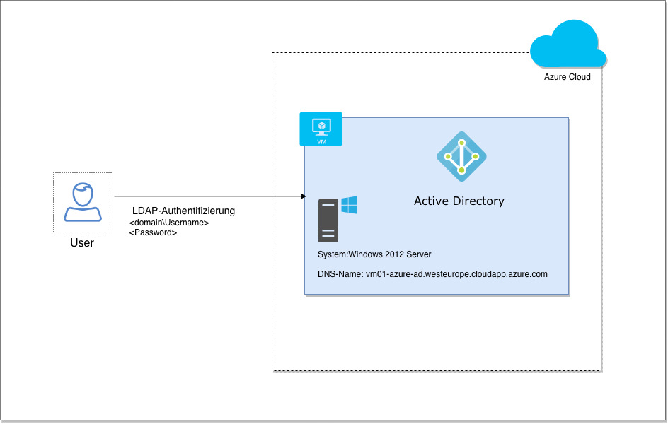

== Architektur des LDAP-Prototypen == 

Damit die Authentifizierungsfunktionalität, der Web-Applikation getestet werden kann, muss ein entsprechender Server zur Verfügung gestellt werden. 
Die Microsoft-Azure-Cloud-Plattform bietet mit dem Modell  Infrastructure-as-a-Service virtuelle Computer.
Dies ermöglicht die folgende Architektur: +

Der LDAP-Prototypen besteht aus einem Windows 2012 R2 Server, der auf einer Azure-virtual-machine gehostet wird.
Dem Server werden die Rollen Active Directory Domain Service und Active Directory Domain Controller konfiguriert. Der Active Directory Domain Service  ist für die Speicherung der Nutzerdaten verantwortlich. AD DS nutzt den Active Directory Domain Controller, um Nutzer beim Anmelden authentifiziren zu können. 
Auf dem Azure-Portal wird neben dem virtuelle Computer ein virtuelles Netzwerk erstellt, über das der Server aus dem Internet erreichbar ist. 