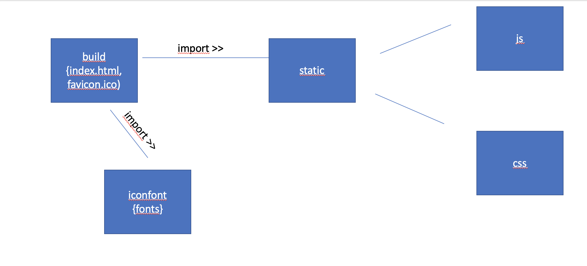

= Entwicklerdokumentation

== Einführung und Ziele
* Aufgabenstellung
Erstellung einer Webseite mit Fomular, in dem man die Daten für einen einen neuen Skill eingeben, ändern und anzeigen lassen kann. Des Weiteren soll die Eingabe im Local Storage des Browsers gespeichert werden, damit auch bei Neuladen der Seite, die eingegebenen Daten erhalten bleiben. Zur Umsetzung sollen React und Redux oder MobX verwendet werden.
* Qualitätsziele
-mögliche Eingabe eines Skills über Fomularfelder
-Anzeigen der Eingabe in einer anderen Übersicht, ausgelöst durch einen Button
-Speicherung der Daten in einem State und lokal auf dem Rechner des Anwenders
-Ansprechende Benutzeroberfläche mit _Material-Design_

== Randbedingungen
* Hardware-Vorgaben +
Rechner, der einen kleinen Webserver laufen lassen kann. 
(theoretisch reicht ein Raspberry Pi)
* Software-Vorgaben +
React, Redux

* Vorgaben zum Betrieb des Software +
Server: Webserver, um Dateien an die Clienten auszuliefern
Client: moderner Browser, der Javascript unterstützt

== Kontextabgrenzung
* Externe Schnittstellen +
-

== Lösungsstrategie
Die Gestaltung der Benutzeroberfläche sollte mit React erfolgen. Dabei sollte der State abgekapselt von React in einem eigenen Objekt gespeichert werden, das Schnittstellen zur Änderung und Anzeige des States bietet. Für die Umsetzung des States habe ich mich für Redux entschieden, da es die Prinzipien des States als _Single Source of Truth_ (es gibt nur einen State im gesamten Programm, der alle Daten enthält und abgekapselt von andern Programmbausteinen ist) und _Schreibgeschüzte Quelle_ für Informationen (Auf den State kann nur lesend zugegriffen werden, um den State zu ändern, muss dieser mit einem neuen überschrieben werden. Dies sorgt für ein klareres Verständis von den Änderungsabläufen im State) klar definiert und umsetzt. Außerdem lassen sich die verschiendenen Programmkompontenten von Redux (Aktionen, Reducer und Store) sehr gut von einander abgrenzen und in einfachen Funktionen definieren.

Im State speichere ich die Daten (Name und Value) für jedes Inputfeld in einer Keymap. Dies ermöglicht es mir bei jeder Eingabe den Wert für das entsprechende Feld zu ändern,da jedes Feld seinen Key zur Verarbeitung weitergibt. Außerdem kann man zur Ausgabe der Daten durch diese Map iterieren und so einfach und übersichtlich die Informationsfelder generieren. 

Die Eingabefelder selber sind als einzelne React Komponenten abgelegt, um das Programm übersichtlich zu gestalten und für einzelene Felder spezielle Attribute (zum Beispiel type=date für Datumsfelder) leichter umsetzen zu können.

Außerdem werden im State der Benutzername und Name der ausgewählten Seite gespeichert, welche durch Drücken eines Buttons von der Anzeige des Formulars zur Anzeige der eingegebenen Daten und zurück gewechselt werden kann. Zur Besseren Übersicht sind die Daten Benutzername, Seitenname und Eingabefelder jeweils in Teilstates ausgelagert, die dann zusammen geführt werden.

Für die Speicherung und Auslesung des States aus dem _Local Storage_ wird das Javascript Standart Objekt localStorage verwendet und das Datenformat JSON, da sich Arrays und Maps, aus denen der State besteht, leicht in dieses Format umwandeln lassen. 

Zur Umsetzung des Designs mit _Material-Design_ habe ich das React Framework _Material-Ui_ verwendet, da es die Verwendung von _Material-Design_ deutlich erleichtert und den Code übersichtlicher werden lässt. Dafür werden werden die verschiedenen nötigen HTML Komponenten für jedes Element in einzelne Reakt Kompononenten mit Attributen zusammengefasst. Die Design Elemente werden also nochmals eine Stufe abstrahiert.

== Bausteinsicht
* Package-Diagramme +

== Entwurfsentscheidungen
* Architektur
* Verwendete Muster
* Persistenz
* Benutzeroberfläche +
Material-Design

[appendix]
== Glossar
* React +
Java Script Libary, um grafische Benutzeroberflächen zu bauen.

* Redux +
Framework zur Abkapselung des States vom Rest des Programms, mit einem funktionalen Ansatz. Lässt sich gut mit React verbinden.

* Mobx +
Framework zur Abkapselung des States vom Rest des Programms, mit einem objekt Orientierten Ansatz. Lässt sich gut mit React verbinden.

* Material-Design +
Open Source Designsprache, welche von Google entwickelt wird.

* Material-Ui +
React Framwwork, welches die Material-Design Elemente als React Componenten bereitstellt.

* Local Storage +
Speicher im Browser des Anwenders, auf dem Dateien von Webseiten abgelegt und ausgelesen werden können.

* State +
Datenstrukture in Bezug auf React, in der man alle Daten, die für den Betrieb der Seite benötigt werden ablegt, um daraus seine Seite aufzubauen. Änderungen auf der Seite durch den Nutzer, wie zum Beispiel Eingaben, sollen auch im State erfasst werden.